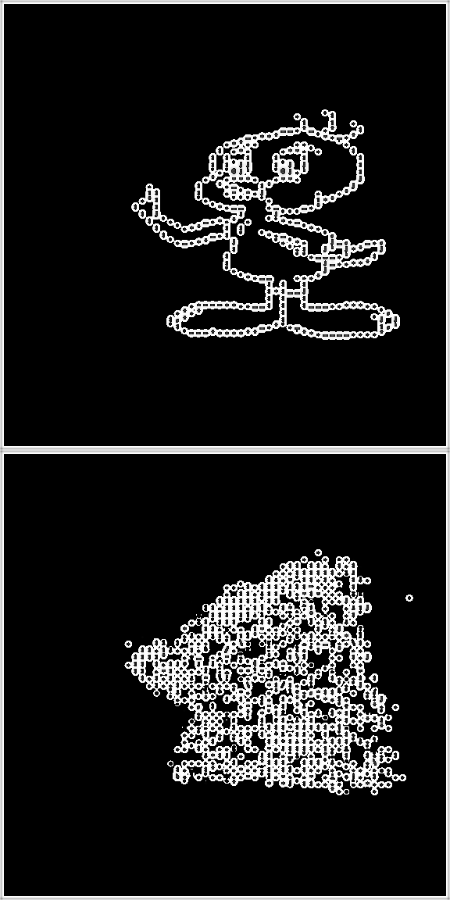

# VAE Autoencoder

The goal is a continuous transfer function from the one hot to the rendered ASCII image. This may be achieved by using a model that can translate a slightly noisy one hot representation into the rendered image. Call this onehot2raa. Freeze onehot2raa during training of the one hot vae. The reconstruction loss of the vae will be the output of onehot2raa compared to the baseline rendered image.


### cb2c7dd50f251e700ee6a8ad22e63917bc5a4f3b: model `./models/16precision_random_roll_with_im_loss_nz256_with_char_weightcheckpoint`

* This model was trained for about 1500 epochs
* Trained using CE loss with character weights, `(1/char_freq)**0.7`
* Also included some varying image loss using the continuous renderer
* It was able to start to generate some patterns that matched the shape and characters of the input image, but every reconstruction was very splotchy and vague.
* 'Images' containing lots of characters, being outliers, were actually predicted very well by the model
* Images containing mostly whitespace in comparison, were usually not well done


### commit: model `models/stage0_gumbel`

* This model was trained using these args: `bpython train.py --renderer-type continuous --ce-recon-loss-scale 0.0 --kl-coeff 0.05 --image-recon-loss-coeff 100.0 --n-workers 16 --validation-prop 0.05 --learning-rate 4e-5 -b 128 -n 500 --run-name stage0_gumbel --print-every 2 --gumbel-tau 0.5`
* L1 Loss
* After about 90 epochs, the model reconstructed spaces everywhere for most samples
* It was difficult looking at a plot of the loss over time to determine that the loss was decreasing.

### Commit: 469523a0af9a3874b9ae2516770ace755989c03d

* Trained with gumbel-tau of 0.5
* Only used mse image loss
* This model was run on a small subset of the dataset, 31 images
* It was able to start to reconstruct halfway close representations
	* I found that training with the same args, but 0.3 tau led to the model not reproducing as well, not makeing anything but whitespace.

```
                                                                   |
                                                                   |
                  -.                       .-                      |
              _..-'(                       )`-.._                  |              `   ``  `       `                `         `
           ./'. '||\\.      _ _ /| ACK!  .//||` .`\.               |    `  ` `` `````l[[```[[l`````` ` `  ` ` ` ``````````` `  ``
        ./'.|'.'||||\\|..   \'o.O' /  ..|//||||`.`|.`\.            |    ` `````````Jl[[[l[[[[[[`````````` ```[l``[`[[[`[[```````` ````
     ./'..|'.|| |||||\``````=(___)=''''''/||||| ||.`|..`\.         |   `` ```````[[[[[[[[[![[[[[[[[[[[`````[[[[`[[[[[[[[[[[[[[`l``````
   ./'.||'.|||| ||||||||||||.  U  .|||||||||||| ||||.`||.`\.       |    .``[``[[[[[[[![[[[[[[[[[[[[[[[[[[[[[[[[[[[[[[[[[[[[[[[[[[`````
  /'|||'.|||||| |||||||||||||     ||||||||||||| ||||||.`|||`\      |   [```[[[l[![[[[[[![[[[[![![[[[[[[[[[[[[[[[[[[[[[[[[[[[[[[[[l[[[``
 '.|||'.||||||| |||||||||||||     ||||||||||||| |||||||.`|||.`     |   [`[[[[![[[[[[[[[[[[[[[[[[[[[[[[[[[[[[[[[[[[[[[[[[[[[[[[[[[[[``|`
'.||| ||||||||| |/'   ``\||``     ''||/''   `\| ||||||||| |||.`    |   ``[[[[[[`[[`[[[````````````` `````[[[[[`[`|[[[[[[[[[[[[[[[[[[[``
|/' \./'     `\./         \!|\   /|!/         \./'     `\./ `\|    |   ```|[[[``[` ````````````` ``   `````````````````` `````````[````
V    V         V          }' `\ /' `{          V         V    V    |   ` [ ``` `        `                  ``  ````````` `     ```` ```
`    `         `               V               '         '    '    |                                              ` `  `        `  ` `
```

### What to pick for `font_res` and `font_zoom`

* 7 allows the proper rendering of zeros and most letters, but [ characters look indistinguishable from |

### Commit: 9b3168b6459805b09fa37be7587d235a67634393

* `bpython train.py --font-res 7 --font-zoom 21 --ce-recon-loss-scale 1.0 --space-deemph 1e5 --kl-coeff 1.0 --image-recon-loss-coeff 1e-3 --n-workers 16 --validation-prop 0.995 --validation-every 10000 --learning-rate 5e-4 -b 128 -n 10000 --run-name models/gumbel_image_overfit --print-every 10 --gumbel-tau 0.3`
* Not as good as 469523, which I could not replicate
* Used a combination of image loss and ce loss
* 3000 epochs on 19 training files.

```
                  -.                       .-                      |                                             \
              _..-'(                       )`-.._                  |             . ]  ]   ] /  ] ]  ]] ]   ] |]]].  ]\].  ]
           ./'. '||\\.      _ _ /| ACK!  .//||` .`\.               |   ] ]   ]  ].]`.].]..]]]`\]]].]]]]]]_]]].].]]]]`]]'`]]] :]]]
        ./'.|'.'||||\\|..   \'o.O' /  ..|//||||`.`|.`\.            |     ]]]]].]]]]']`'|].|]|.|]``]]]]']]|]]'|.)`|||]']/]]]]..]]]|]]
     ./'..|'.|| |||||\``````=(___)=''''''/||||| ||.`|..`\.         |    ]]']]]]]||]||||||||]|||||||]|]]'||]||||||||||||||]]]|]]]]]]]]]]
   ./'.||'.|||| ||||||||||||.  U  .|||||||||||| ||||.`||.`\.       |    ].]]]]]|]||||||||||||||||||||||||||||||.|||||||||||||||/]]]]]]
  /'|||'.|||||| |||||||||||||     ||||||||||||| ||||||.`|||`\      |   -'|.|]||||||||||||||||||||||||||||||||||||||||||]||||||||]||||]`
 '.|||'.||||||| |||||||||||||     ||||||||||||| |||||||.`|||.`     |   ]]|]|]||||||||||||||||||||]||]||||||||||||||||]||||||]||||||`]]]
'.||| ||||||||| |/'   ``\||``     ''||/''   `\| ||||||||| |||.`    |   ]]|]]]|]||||]||]|]]||]]]|]]]].]||'|]'])|||]|']']|]||.|||.|'||]|]
|/' \./'     `\./         \!|\   /|!/         \./'     `\./ `\|    |   ] ]] ]]]]]]]]]]]]]']]]]]]]`]']]]]]]] ]]]]] ]`]]`]]]]`]]]]]|'] ]h
V    V         V          }' `\ /' `{          V         V    V    |       ]                         ] ] ] ]                  ]]]] ]
```


### Commit: 20717f245465d08bf7b58b392e87e0b4ec8e6f74
```
bpython train.py --font-res 9 --font-zoom 21 --ce-recon-loss-scale 1.0 --space-deemph 1e5 --kl-coeff 0.1 --image-recon-loss-coeff 4e1 --n-workers 16 --validation-prop 0.025 --validation-every 100 --learning-rate 5e-4 -b 164 -n 10000 --run-name models/image_512 --print-every 10 --gumbel-tau 0.2
```

* Trains well. The image loss definately makes a difference compared to the model that was trained only with the ce loss

* Images are from 2200 epochs on 97.5% of the data. Training loss went down to about 2.1. Validation loss was about 3.0

* Increasing the KL coefficient should force the model to overfit less

```
                                                                   |                                     _.__
                                                                   |                                 ___._______.
                                _.____                             |                               _______________
                             _.'      '_.                          |                           ._______'__'__/___.
                         _.-'       _.'  \                         |                         ____________'.-'-\|.\|
                       _'___     _.'      |                        |                       .'_'___:`_'\_.|.'`...<||
                     .'     '-.-'         L                        |                      ,_'G_.`_|'.|`.:'.'--'_O||
                    /          \          |                        |                     ..:|.:.:#L\:.:|d\|--'-'.||
                   |     __     |         L                        |                     |||`;Ag$\"$$\|"U.::.`-;||||
                   |   .x$$x.   L         |                        |                     |||':.$"$#$$|.|.\-.._'.-|||
                   |   |%$$$|   |         |                        |                     |||.s|$$U|$#$'|::-.'.''-|||
                   |   |%%$$|   L         |                        |                     |||/J|%%$$%%%JJK.:.-:.-.L|
                   |   '%%%?'   |         .\                       |                     ||`||%%;%|%%/||8^-|'.'-LL||
                    \          /|      .-                          |                     |:|V:%|%.%-"|)'..-'.-.'||L.
                     '.__  __.' |   .-    Pr                       |                     ``|'.._..%.#|:':----,:_.jrg9
                         ''      \.-      59                       |                      ``|-`.;.:-'..|...-..^--5r9
                                                                   |                       ```` ```.`..`.-----"-`-
                                                                   |                               ````.------
                                                                   |                                      -
```

### Running edge detection on input and reconstructed images

* Implemented in commit 66ea1d618d27888f547dbd52c3ca9e1d9b1cb7c6
* Didn't function very well, the edges didn't become joined enough. Ideally, shapes like this should have all of the near segments joined together, to make one continuous shape:
```
                  _---------_
                 /           |                  
                /            \                 
               /              |
              /               |
              -______________/
```

<p align='center'>

</p>

### Image Loss


MSE and L1 loss functions are poor approximations of what a human would automatically discern as 'loss' between input and reconstruction. 

Humans tend to blur together the parallel lines, picking out shapes and patterns from the disjoint characters in the image. Using discrete methods, you could recreate these patterns by using pixel dilation and erosion. It is hard to think of a contiuous transformation that would be able to pull out the 2D shapes from the disjoint pixel regions. 


### commit 2e13fa90c6766b1ec426ab4be8738eed1ec82c18

Trained for ~ 16,000 epochs in about 2 days. The model ./models/nov2022-hlrcheckpoint/25-11-2022_14-53/epoch=16309-step=358820.ckpt produces decent reconstructions. It was trained with moderately high kl loss. After about 18000 epochs, the model started producing only lank images when discretely rendered. The validation ce loss and validation image  loss changed to NAN. This can be seen in the ./models/nov2022-hlrcheckpoint/run/version_1 logs. I don't know why the image loss and ce loss became NAN, while the KL loss remained as expected.

Looking at the saved images from this training, they were all plack pixels! This happens very suddenly at epoch 16815. It is weird to me that the `t_im_loss` looks like it continued taking it's usuall values, even though the model was logging all black images.

Reloaded training from a good epoch, 16000. I lowered gumbel-tau which was 3e-5. Also increased batch size

The NaNs were caused by an intermediate layer in the decoder, the last conv2d layer. I found this out by stepping through the layers with a batch that caused the NaNs. The outputs up the that last layer all looked good, and with reasonable non exploding values. I think the decoder started producing NaNs because the CE loss forces the log output of the model to approach 0, which causes the model's output to approach infty before the softmax layer.

`bpython train.py --font-res 9 --font-zoom 21 --ce-recon-loss-scale 1.0 --kl-coeff 0.05 --image-recon-loss-coeff 50.0 --print-every 5 --run-name models/nov2022-hlr  --datapath ascii-dataset --n-workers 16 --learning-rate 4e-5 -b 186 -n 25000 --validation-prop 0.05 --validation-every 10 --space-deemph 100 --gumbel-tau-r 7e-6 --load models/nov2022-hlrcheckpoint/25-11-2022_14-53/epoch=16309-step=358820.ckpt`


### Commit f27fb91b0791bf6b51fc5c97861e50d0efa57819 NLLL

Trained for 25,000 epochs in about 2 days. Reconstructions don't look as good as those using CE loss. Seems like it is more confident to produce weird characters rather than the safe option. In this commit the reconstruction loss between base and predicted classes was not run through gumbel.

`
bpython train.py --font-res 9 --font-zoom 21 --ce-recon-loss-scale 1.0 --kl-coeff 0.05 --image-recon-loss-coeff 50.0 --print-every 5 --run-name models/nov2022-nlll  --datapath ascii-dataset --n-workers 16 --learning-rate 5e-5 -b 256 -n 25000 --validation-prop 0.05 --validation-every 10 --space-deemph 100 --gumbel-tau-r 1e-5 --log-name 50-imloss-se100-scratch --load models/nov2022-nlllcheckpoint/01-12-2022_20-47/epoch=1009-step=15150.ckpt
`
